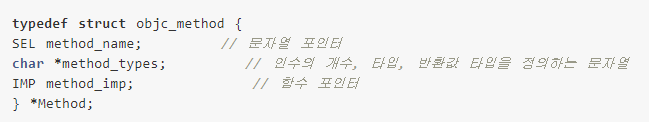

# 1.4 Objective-C 런타임

### 런타임 이란 ?

- 클래스와 메타클래스를 메모리에 로딩하는 역할을 담당.
- 실행 중에 객체에게 보내는 메시지를 처리할 메서드를 찾거나, 객체 메모리 관리, 동적 타입 변환 등을 처리하는 C 함수 라이브러리

### 메시지 디스패치

Objective-C는 객체의 메서드를 직접 호출하지 않고 스몰토크 언어의 방식, 즉 **객체에 명령**을 내리는 방식으로 동작한다. 따라서 대부분의 언어에서 "메서드를 호출한다." 라는 표현을 옵씨에서는 "**메시지를 전송한다**." 라고 표현한다.

```objectivec
Fraction *a = [[Fraction alloc] init];
Fraction *b = [[Fraction alloc] init];

[a setTo:1 over: 3];  // 분자, 분모를 세팅
```

객체에 메시지를 보내는 **[a setTo:1 over: 3];** 코드를 보고, 컴파일러는 메서드 이름을 setTo:over: 이라고 판단하고, 컴파일하면서 다음과 같이 **objc_msgSend()** 런타임 API를 사용하는 코드로 대체한다.

```objectivec
objc_msgSend(a, @selector(setTo:over:), 1, 3);
```

실행 중에 옵씨 런타임은 objc_msgSend()를 실행하면서 메시지로 어떤 메서드를 실행할지 메시지 디스패치 과정을 통해 찾아낸다.

1. objc_msgSend 함수는 첫번째 인자로 받은 수신객체의 **isa**(객체를 생성하는 클래스 구조체를 가리키는 포인터)를 참조한다.
2. 수신객체가 nil이면, 메시지 디스패치는 그대로 종료된다. 이로 인해, 옵씨에선 nil 타겟으로 메서드를 수행해도 아무 문제가 없다.
3. 참조한 클래스의 **내부 캐시**에서 selector로 넘어온 **IMP**(함수 포인터)를 찾고, 있으면 포인터를 따라 해당 함수를 호출한다.
4. 클래스의 내부 캐시에 없는 경우, 클래스의 **디스패치 테이블**(책에서 말하는 객체의 메서드 구현부 인 것 같음)에서 IMP를 찾고, 있으면 포인터를 따라 해당 함수를 호출하고 내부 캐시에 저장한다.
5. 클래스의 디스패치 테이블에 없는 경우, 이 클래스의 Super 클래스에 대한 참조를 따라 Super 클래스에서 다시 디스패치 테이블을 검사한다. 이런 식으로 쭉 타고 올라가다가 최상위 클래스인 NSObject에 도달한 후에도 찾지 못하면 런타임은 수신객체가 해당 셀렉터를 처리할 수 없다고 판단, 후속 처리를 시작한다. (여기서 후속처리라고 표현하는 것은, 바로 예외(크래시)를 발생시키지 않고 수신객체에게 처리할 수 있는 기회를 한 번 더 주는데 이를 **[Forwarding](https://devyongsik.tistory.com/568)** 이라고 한다... -_-;;??)

즉 요약하면, 수신객체 클래스의 캐시와 디스패치 테이블에서 selector와 연결된 함수포인터(IMP)를 찾고 있으면 해당 함수를 호출, 없으면 포워딩.

이런 방식으로 ObjectiveC의 메소드 호출은 실행시간에 호출해야하는 프로시저가 동적으로 결정된다. 이를 좀 전문적인 용어로 표현하면 “**메소드가 메시지에 동적으로 바인딩된다**”고 할 수 있다.

이러한 간접적인 함수호출은 타언어에서의 직접적인 함수호출보다 비용(시간)이 많이 든다. 하지만 이 차이는 실제로는 아주 근소하다고 한다. 또한 런타임은 객체가 한 번 호출한 프로시저는 높은 확률로 다시 호출한다고 보고 한 번 호출했던 프로시저의 포인터는 모두 캐싱한다. 이 캐시의 양은 앱이 시작된 후부터 동적으로 증가하여 이내 충분한 양으로 축적된다.

### 번외 ...

1. 특정 셀렉터와 IMP를 연결시켜주는 것을 Method Structure 라고 한다.



2. 실제 프로젝트에서도 런타임 API를 통해 메서드 호출을 대신할 수 있다.

```objectivec
Fraction *a = [[Fraction alloc] init];
Fraction *b = [[Fraction alloc] init];

objc_msgSend(a, @selector(setTo:over:), 1, 3);
```

단,  Xcode 6부터 objc_msgSend 함수를 이용한 부분에 모두 "Too many arguments to function call...." 에러가 발생했다고 한다. 프로젝트 설정에서 preprocessing 컴파일옵션의 "Enable Strick Checking of objc_msgSend Calls" 을 YES에서 NO로 변경하면 에러를 지울 수 있으나, 되도록 사용을 지양하는 것 같다. 되도록이면 에러가 런타임이 아닌 컴파일에 잡힐 수 있도록 ?

[Message Dispatch 더 알아보기](https://jcsoohwancho.github.io/2019-11-02-Message-Dispatch/)