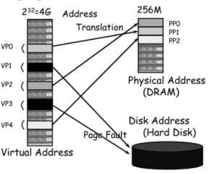

# 7/7 메모리 관리

### 2.1 메모리와 객체

2.1.1 객체 인스턴스 생성

macOS와 iOS를 비롯한 운영체제는 프로세스 주소 공간보다 항상 물리적인 메모리가 상대적으로 부족하기 때문에 가상 메모리 방식을 사용합니다. 가상 메모리 방식은 물리적인 메모리보다 더 큰 메모리를 사용하기 위해 메모리에 데이터를 페이지 형식으로 저장하고 필요할 때마다 불러오는 방식으로 더 큰 메모리를 사용합니다. 즉, 제한적인 메모리로 인해 앱 성능에 좋지 않은 영향을 끼칠 수도 있는 것입니다.



그림 1. 가상 메모리 방식

이렇기 때문에 메모리를 잘 고려해서 프로그래밍을 해야하며, 객체를 구현할 때 우선적으로 객체의 생명 주기를 예측 가능하게 만들 수 있어야 합니다. 보통 objective-c에서는 객체 인스턴스를 만드는 경우 다음과 같이 두 단계로 작성합니다.

```swift
Pen *aPen = [[Pen alloc] init];
```

```swift
+alloc {
    id newObject = malloc(self->clsSizeInstance, 0);
		newObject->isa = self;
		return newObject;
}
```

객체 인스턴스는 메모리에 할당 된 이후, 생성자 메서드가 호출된 시점부터 객체 생명 주기가 시작됩니다. 만약 객체 내부에 하위 객체가 있으면 생성자에서 하위 객체 인스턴스를 생성해야합니다.

객체가 생성될 때 메모리는 각 객체의 크기에 따라 영역이 구분되어 할당 됩니다. 이를 통해 작은 공간들이 파편화 되어 큰 객체는 들어갈 수 없는 문제를 방지합니다.

[메모리 할당 단위](https://www.notion.so/5395eecfd03749a59f473abebd644ec3)


그림 2. 할당 단위 별로 영역이 구분 된 힙 메모리

이렇게 객체 뿐만 아니라 메모리에는 이미지 리소스도 올라가는데 이 역시 주의해야 합니다. CALayer를 사용할 경우, 또는 UIImage(name: )과 같은 메소드로 이미지를 생성할 경우 의도하지 않았더라도 시스템 내부에서 이미지를 캐싱하기 때문에 항상 주의가 필요합니다.

2.1.2 객체 인스턴스 소멸

객체 소멸자는 객체가 생성 될 때와 반대로  되기 직전에 호출됩니다. 객체 내부에서 생성한 객체 인스턴스가 있다면 반드시 먼저 해제해주고 소멸해야합니다. 그래야 garbage가 메모리에 남는 문제를 방지할 수 있습니다.

objective-c에서는 객체 인스턴스에 release 메세지를 전달해, 객체 인스턴스가 dealloc 메소드를 호출해 객체를 해제할 수 있도록 합니다. swift에서는 이 대신 deinit을 사용합니다. 차이점이 있다면 objective-c에서는 수동으로 메모리 관리 방식을 구현해서 소멸 시점을 명시적으로 정할 수 있지만, swift는 ARC 방식을 이용해 소멸 시점을 지정하기 어렵습니다.

요즘 디바이스의 대부분은 가상 메모리의 크기도 크고 지역 관리 (메모리 수동 관리)도 필요한 경우가 거의 없습니다. 즉, 프로그램에 대한 데이터 구조를 줄이고 조정하는 케이스는 많이 없어졌지만 객체 인스턴스를 메모리에 생성해서 소멸할 때까지의 과정을 메모리 관리 측면에서 이해하고 있는 것이 더 효율적인 프로그램을 작성할 수 있을 것입니다.
