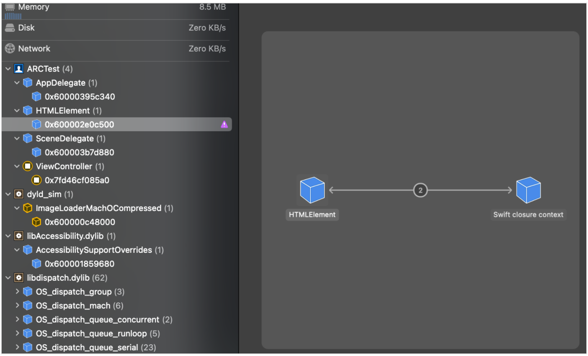
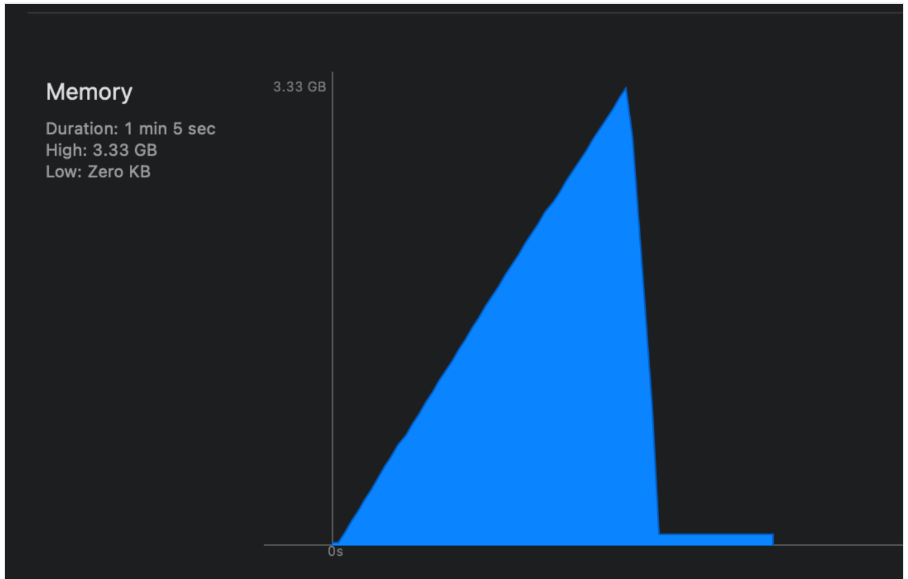

## 2.2 참조 계산

- 애플은 객체 인스턴스를 확인하기 위해 참조 계산(reference counting)방식을 제공
- 참조 카운터 공간이 있어, 해당 객체의 참조 횟수를 계산한 값을 기록
- 객체가 처음 생성되면 카운트가 1 증가하고, 이 객체를 참조하는 다른 객체가 있을 때 마다 참조 횟수가 1씩 증가
- 참조하던 객체가 더이상 참조하지 않으면 1씩 감소
- 참조하는 객체가 더이상 없다면 메모리에서 해제


### 자바 가비지 컬렉션 방식
[가비지 컬렉션](https://mirinae312.github.io/develop/2018/06/04/jvm_gc.html)

- 메모리 신경 안쓰고 메모리 해제
- 지금까지 계속 발전해와 여러 방식 존재
- 순환 참조도 알아서 끊음 (GC 루트에서부터 시작하는데, 루트에서 끊었는데 서로 순환참조되어 남은것들은 수집 대상이됨)
- 오토릴리즈 풀이랑 비슷한 느낌..?

### 2.2.1 객체 소유권

- 객체 A가 B를 참조하는 동안 객체 B가 메모리에서 사라지지 않는다는 것을 보장하는 방법
- 참조 카운트 증가시키고, 반환하는거라고 이해함

#### dangling pointer
(Objc, non-arc )
```objc
MyClass *valA = [[MyClass alloc] init];
MyClass *valB = valA;

[valA release];

NSLog(@"%@", valB.description); //crash
```
TO-BE 
``` objc
MyClass *valA = [[MyClass alloc] init];
MyClass *valB = [valA retain];

[valA release];

NSLog(@"%@", valB.description);
```

### 자동 반환 목록

- 일정 시간 뒤에 반환할 객체 목록을 만들어서 관리

(Objc, non-arc )
``` objc
NSAutoreleasePool *autoreleasePool = [[NSAutoreleasePool alloc] init];
MyClass *valA = [[MyClass alloc] init];
MyClass *valB = valA;

[valA autorelease];

NSLog(@"%@", valB.description);

[autoreleasePool drain];

NSLog(@"%@", valB.description); //crash
```

@autoreleasepool 사용 (swift에서는 autoreleasepool 함수에 클로저 형태로 전달)

``` objc
@implementation ViewController
{
    MyClass *valA;
    MyClass *valB;
}

- (void)viewDidLoad {
    [super viewDidLoad];
    
    [self autoreleaseTest];
    
    NSLog(@"%@", valA); //crash
}

- (void)autoreleaseTest {
    @autoreleasepool {
        valA = [[MyClass alloc] init];
        [valA autorelease];
        valB = valA;
        
        NSLog(@"%@", valB);
    }
}

@end
```

### 간편한 메서드와 자동 반환 대상

- 객체를 생성하면서 자동 반환 목록에 추가하는 객체가 존재
- alloc, init, autorelease등록 까지 해주는 팩토리메서드들 존재
- 스레드 마다 하나씩 자동반환 대상을 관리하고, 해당 스레드가 끝날 떄 같이 소멸되도록 권장
- main쓰레드에 대해서는 따로 만들지 않아도 괜찮음
- main 쓰레드의 autoreleasepool > drain은 런루프 이벤트 끝나면 발생 (런루프 시작할 때 마다 autoreleasepool로 감싸서 실행)

[참고](https://developer.apple.com/documentation/foundation/nsautoreleasepool)
```
The Application Kit creates an autorelease pool on the main thread at the beginning of every cycle of the event loop, and drains it at the end, thereby releasing any autoreleased objects generated while processing an event. If you use the Application Kit, you therefore typically don’t have to create your own pools. If your application creates a lot of temporary autoreleased objects within the event loop, however, it may be beneficial to create “local” autorelease pools to help to minimize the peak memory footprint.
```

``` swift
for _ in 0...10000000 {
    let image = UIImage(named: "test")
}

for _ in 0...10000000 {
    autoreleasepool {
        let image = UIImage(named: "test")
    }
}
```




### 순환 참조




### 객체 사이 순환 참조 해결방법

#### 1. weak, unowned
- weak : 참조 카운트를 증가시키지 않고 참조, 옵셔널
- unowned : weak와 같고, 옵셔널이지만 사용하는 시점에 참조한 객체가 nil이면 크래시 발생,  라이프사이클을 같이하는 경우나 값이 항상 있다고 판단되는데 순환참조를 피해야할 때 사용

Like a weak reference, an unowned reference doesn’t keep a strong hold on the instance it refers to. Unlike a weak reference, however, an unowned reference is used when the other instance has the same lifetime or a longer lifetime
Use an unowned reference only when you are sure that the reference always refers to an instance that hasn’t been deallocated.

#### 2. 클로져 > 캡쳐드 리스트 사용

``` swift
class Car {
    var speed: Float = 0.0
    var increaseSpeed: (() -> ())?
}

var myCar = Car()
myCar.increaseSpeed = { [unowned myCar] in
    myCar.speed += 30
}

print(myCar.speed)
myCar.increaseSpeed?()
print(myCar.speed)
```

#### 3. 사용 후 nil 처리

###  Copy on write
Copy on write (이하 COW)는 데이터 복사시 실제로 값을 복사되지 않고, 동일한 값을 참조하다가 데이터 변경이 발생될 시에 복사해 값을 변경하는 기법
Swift에서는 원시타입 구조체(Int, Double, String)와 Array, Set, Dictionary등 컬렉션 구조체에 이미 구현

``` swift
var varA = [1, 2, 3, 4]
var varB = varA

print(addressOf(varA))
print(addressOf(varB))

varA.append(5)

print(addressOf(varA))
print(addressOf(varB))

/*
0x6000002a4160
0x6000002a4160
0x6000033a0860
0x6000002a4160
*/
```

### struct in closure

클로져에서 참조하는 strcut 는 참조타입으로 취급
값 타입으로 처리하려면 캡쳐드리스트에 추가

``` swift
var anInteger = 42
 
let testClosure = {
    // anInteger는 capture되는 순간 reference copy됨
    print("Integer is: \(anInteger)")
}
 
anInteger = 84
 
testClosure() // Prints "Integer is 84"
```

``` swift
var anInteger = 42
 
let testClosure = { [anInteger] in
    // anInteger는 capture되는 순간 value copy됨
    print("Integer is: \(anInteger)")
}
 
anInteger = 84
 
testClosure() // Prints "Integer is 42"
```
