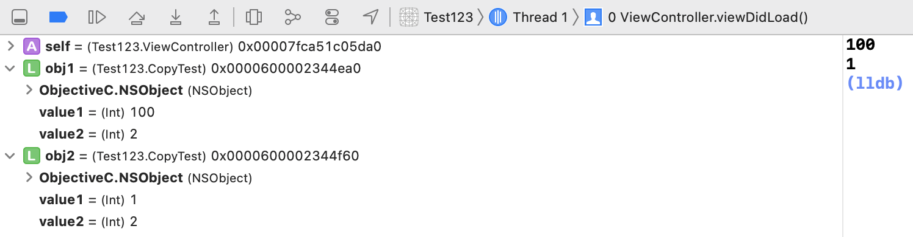

# 4.1 NSCopying 계열 프로토콜

### 코코아 프레임워크에서 객체를 복사하기 위한 방법

- NSCopying 또는 NSMutableCopying 프로토콜을 채택한 뒤, 프로토콜 메서드를 구현하는 방법을 권장
- 두 프로토콜의 차이는 복사한 객체가 Mutable 객체인지 아닌지.

### 복사만 가능한 객체

- 객체가 복사 가능한 객체라면, **NSCopying** 프로토콜을 채택하고 copy(with zone:) 메서드를 구현한다. 여기에서 인자값으로 들어오는 NSZone 타입은 더이상 사용하지 않는 값으로 nil. 현재 모든 앱은 단일 존(기본 존)을 가지기 때문.

```swift
final class CopyTest: NSObject, NSCopying {
    var value1: Int
    let value2: Int
    
    init(_ value1: Int, _ value2: Int) {
        self.value1 = value1
        self.value2 = value2
        
        super.init()
    }
    
    func copy(with zone: NSZone? = nil) -> Any {
        let obj: CopyTest = .init(value1, value2)
        return obj
    }
}

final class ViewController: UIViewController {
    
    override func viewDidLoad() {
        super.viewDidLoad()
        
        let obj1: CopyTest = .init(1, 2)
        let obj2 = obj1.copy()
        
        obj1.value1 = 100
        
        print(obj1.value1)
        print((obj2 as? CopyTest)?.value1 ?? 0)
    }
}
```



복사할 객체와 복사된 객체가 참조하고 있는 주소값이 다르고, property들의 값이 같은 것 확인 할 수 있다.

### 복사와 수정이 가능한 객체

- 코코아 프레임워크에서 copy 메서드로 복사하는 객체는 immutable 객체로 가정. 예를 들어 NSString 객체를 copy 메서드로 복사하면 문자열의 내용을 바꿀수가 없다.
- 객체를 수정 가능한 가변(mutable) 객체로 복사하기 위해서는 **NSMutableCopying** 프로토콜을 채택하고, mutableCopy(with zone:) 메서드를 구현하면 된다.
- 객체를 복사하는 과정에서 복사할 원래 객체가 가변인지 불변인지는 상관없다. 새로 만들 객체가 가변이냐 불변이냐로 NSCopying 을 채택할지 NSMutableCopying을 채택할지 구분.

### 요약

- 객체를 복사하고 싶으면 NSCopying, NSMutableCopying 프로토콜을 채택하고 프로토콜 메서드를 구현하자.
- 객체가 가변, 불변 둘 다 가능하다면 NSCopying, NSMutableCopying 두 프로토콜을 모두 채택하자.
