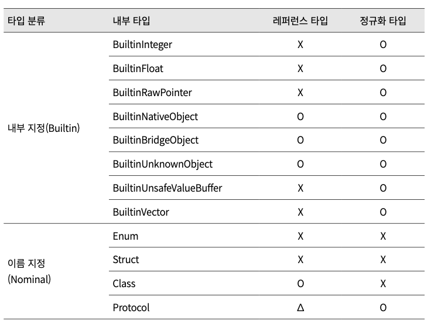
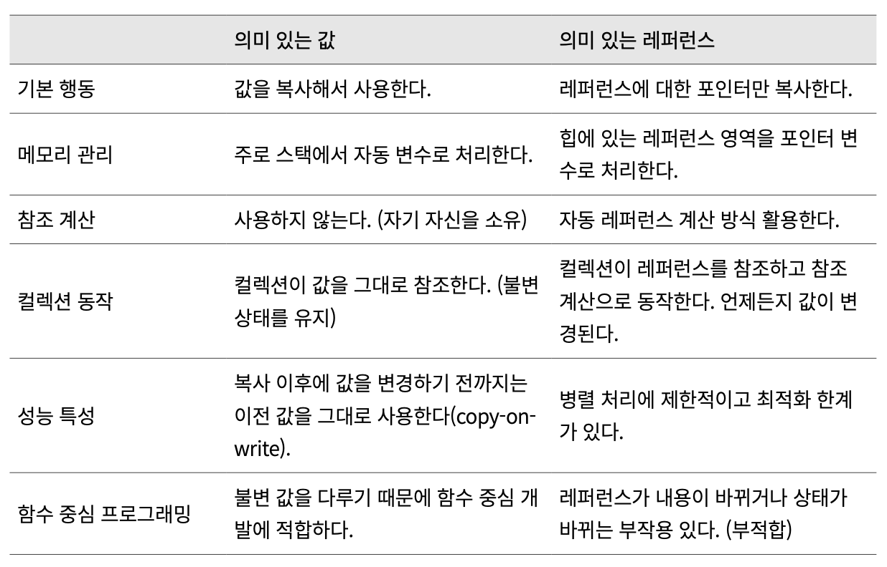
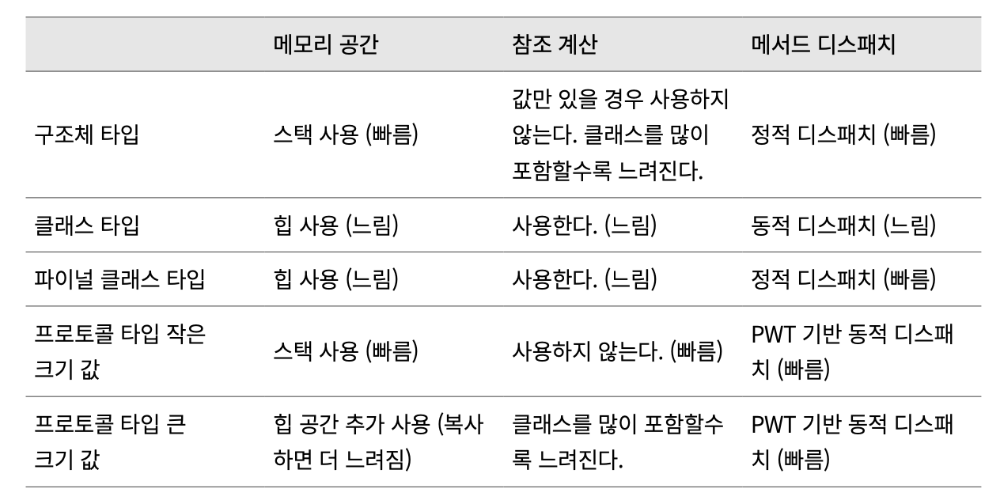

## 9.1 타입 시스템

스위프트는 명시적인 타입(Nominal typing) 시스템이다. 오브젝티브-C처럼 모든 객체가 다이내믹 타입은 아니지만 프로토콜 타입을 활용해서 다이내믹하게 확 장하면서도 오브젝티브-C보다 안전하게 쓸 수 있다.

### 9.1.1 스위프트 타입

스위프트에는 크게 두 종류의 타입이 있다. 이름 있는 타입(named type)과 이 름 없이 합쳐진 타입(compound type)이다.

합쳐진 타입은 튜플(tuple)이나 클로저/함수 타입으로 이름이 따로 정해지지 않고, 다른 타입들을 합쳐서 사용하는 타입이다. 
ex) (Int, (Int) -> (Int))

이름 있는 타입은 클래스, 구조체, 열거, 프로토콜 같은 타입의 이름이 미리 정
해진 형태를 말한다. 합쳐진 타입을 제외한 모든케이스는 이름이 있는 타입

#### 내부 타입 유형
스위프트 컴파일러가 내부적으로 구분하는 세부 타입들은 평소에 사용하는 타 입과 사뭇 다르다. 



### 9.1.2 타입 검사

- 스위프트는 안전한 타입 언어를 표방
- 컴파일러가 다 른 타입으로 선언한 변수에 값을 전달하는 것을 미리 방지
- 컴파일하는 동안 안전한 타입 사용을 위해서 타입 검사(Type Check)를 진행
- 타입 검사는 타입이 일치하지 않아서 개발하는 동안 발생 할 수 있는 문제들을 미리 발견할 수 있도록 도와준다.

#### 타입 추론

``` swift
func foo(x: Double) -> Int { ... } 
var doubleValue : Double = 3.141592 
var unknown = foo(doubleValue) //Int type

func bar<T>(x: T) -> T { return x } 
var floatValue: Float = -bar(1.414) //Float type
```

스위프트 타입 추론은 3단계로 진행된다.
1단계는 ‘제약 만들기’, 2단계 ‘제약 계산하기’다. 마지막 3단계 ‘제약 판단하기’ 이다.
스위프트 컴파일러는 제약 사항을 계산할 때, 제약 사항들 조합에 대해 조건 에 부합하는 경우에만 점수를 주고 최종적으로 점수가 가장 높은 타입 제약을 선택한다. 같은 점수일 경우는 좀 더 세부적인(more specific) 타입을 선택한다. 보다 자세한 타입 검사에 대한 문서는 스위프트 오픈소스 TypeChecker.rst 문 서를 참고하자.

### 타입 변환(type cast)

- 타입 변환은 종류가 전혀 다른 타입끼리 타입을 바꾸는 것이 아니라, 비슷한 종 류의 타입끼리만 타입을 바꾸는 것을 의미
- 스위프트에서 String 문자열 타입과 Int 정수형 타입은 구조가 다른 타입이기 때문에 타입 변환이 불가능하다. 
- 구조체 타입이나 클래스 타입에서 상속받은 객체들끼리는 구조 동일성이 유지 되기 때문에 타입 변환이 가능하다
- 숫자를 표시하는 타입들은 구조가 동일하기 때문에 서로 전환이 가능하다. 다만 값에 대한 손실이 발생할 수 있는 경우에는 반드시 명시적으로 타입을 지정해야만 한다.

### 9.1.3 의미 있는 값 vs. 의미 있는 레퍼런스

- 스위프트는 값과 레퍼런스에 대한 동작을 모두 지원하지만, 무게 중심은 ‘의미 있는 값’으로 쏠려 있다.
- 함수 중심 프로그래밍에서는 함수에서 다루는 변수가 레퍼런 스가 아니고 불변 변수여야만 부작용이 없다. 
- 따라서 값 자체를 다루는 것이 더 의미 있다. 값 방식은 참조 계산을 하지 않기 때문에 그만큼 병렬 처리나 성능 최적화 측면에서 유리하다.



### 타입별 성능 비교

- 스택 메모리의 경우, 사용할 때 스택 포인터(SP 레지스터)를 증가시키고 사용 하지 않을 때 스택 포인터를 감소시키기만 하면 된다. 
- 반면에 힙 메모리를 사용 할 경우, 비어 있는 힙 공간을 찾고 빈 메모리 공간을 처리하기 위한 별도의 데이 터 구조가 필요하다.
- 참조 계산은 우선 참조 개수를 증가시키고 감소시키기 위한 동작이 필요하다. 의미 있는 레퍼런스를 사용할 때 단지 참조 계산만으로 할 일이 끝나지 않는다. 여러 스레드에서 참조 계산에 접근하도록 처리하려면 부가적인 노력과 동작이 늘어난다. 이런 부분에서 의미 있는 값만 사용한다면 참조 계산하는 것보다 좀 더 빠르게 처리할 수 있다.
- 여러 스레드에 대한 안정성 확보를 위한 동작이 필요할 경 우를 힙과 스택을 비교하면 힙이 상대적으로 느리다. 
- 프로토콜 타입으로 확장하 는 경우에도 세 워드(64bit를 기준으로 24Byte)보다 작은 크기 값은 스택만 사용 하지만, 그것보다 큰 크기 값은 힙 공간을 추가적으로 사용하기 때문에 상대적 으로 느려질 수 있다.



- 정적 디스패치는 컴파일 시점에 함수의 메모리 주소를 찾아두기 때문에 런타임 에는 해당 주소로 바로 이동한다. 
- 반면에 동적 디스패치는 런타임 에 구현 함수 목록에서 함수 메모리 주소를 찾아서 이동해야 한다. 동적 디스패 치는 인라인 처리나 최적화가 불가능하다.

### 요약

- 어떤 타입을 사용할지 결정하고, 타입에 적 합한 메모리 관리 방식에 대한 고민이 프로그램 구조에 큰 영향을 준다. 
- 스위프 트는 다양한 타입을 지원하기 때문에 선택의 폭이 더 넓다. 딱 그만큼 개발자의 책임이 더 큰 언어라고 할 수 있다.

